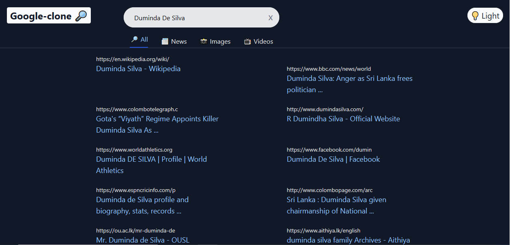

# Google-clone - The Most Unique Search Engine in the World

demo - https://new-google.netlify.app/search

## Introduction
This is a Google Clone Application using React and Google Search API powered by https://rapidapi.com.

## Used dependencies
tailwind css , @craco/craco , react-router-dom , react-player , react-doader-spinner , use-debounce 

Setup:
- run ``npm start`` to start the development server

